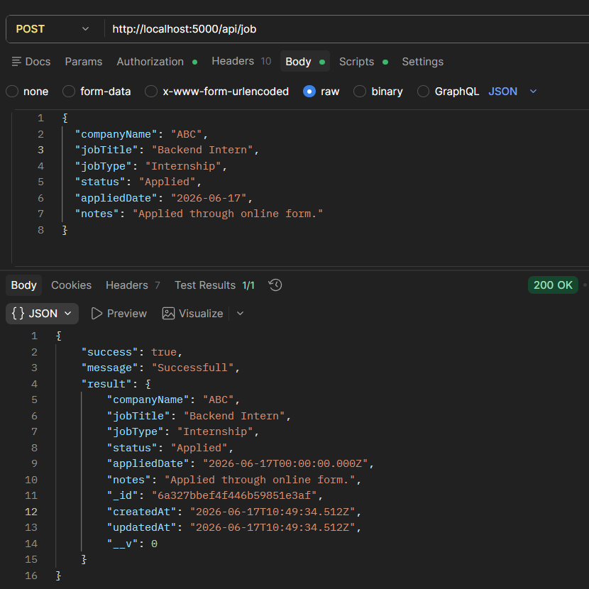
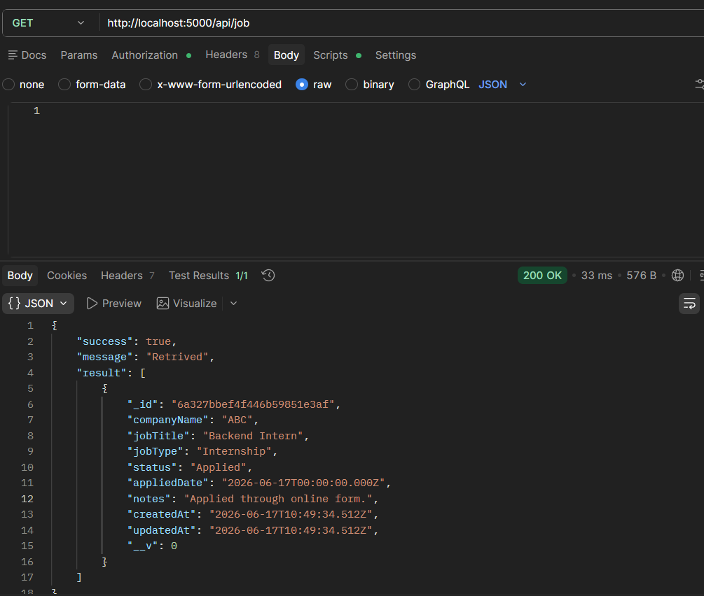
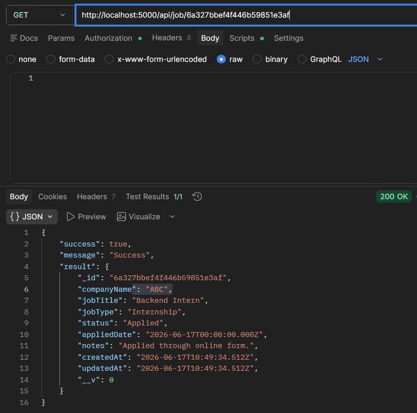
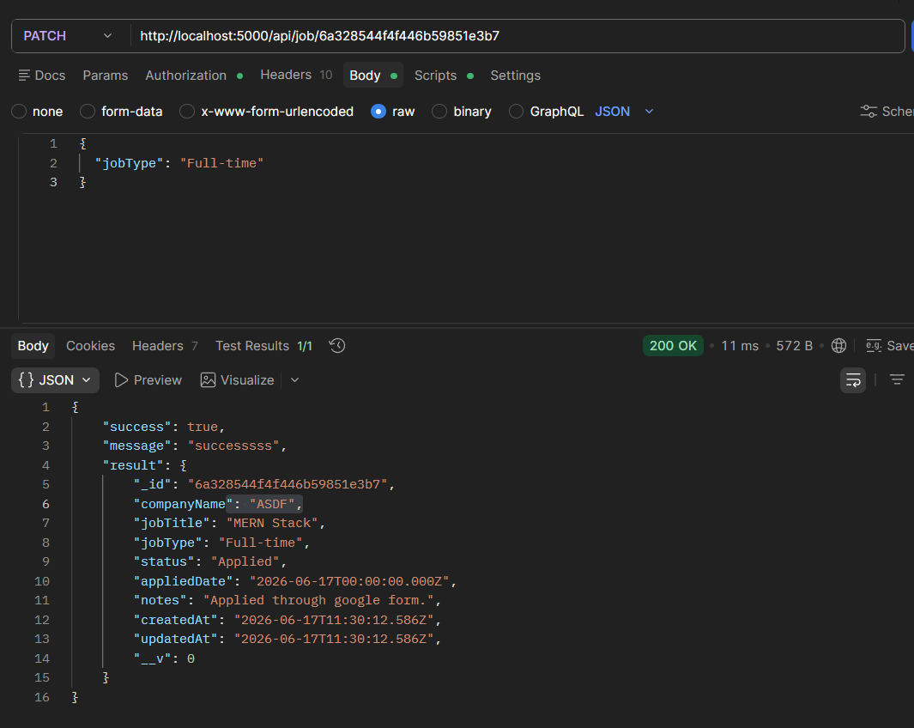
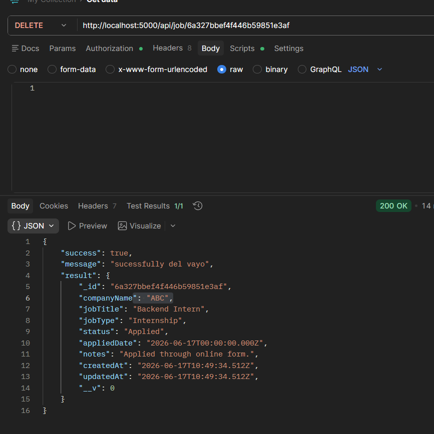
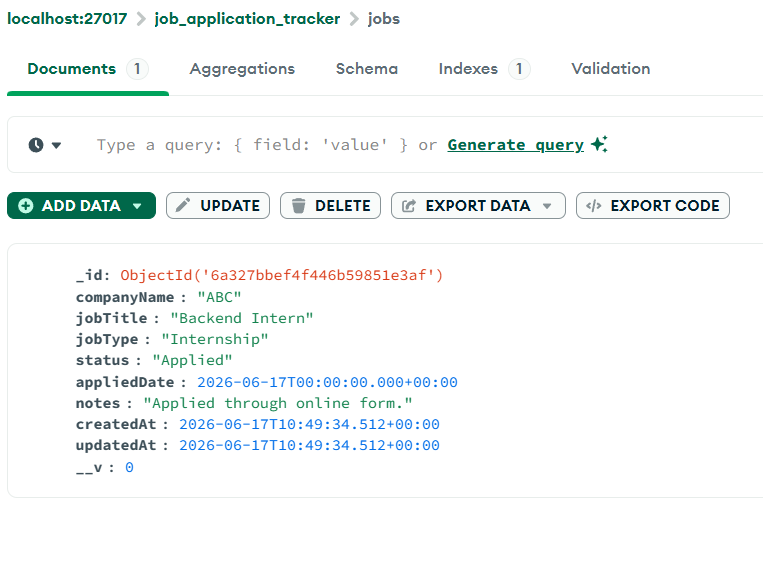

# Job Application Tracker

A full-stack web application for tracking job and internship applications through different hiring stages.

This project is being developed as part of the InternSathi Full Stack Internship assignment.

## Current Status

The backend REST API and MongoDB integration are complete.

The frontend can currently:

* Create a new job application
* Fetch existing applications from the backend
* Display applications in a basic UI
* Clear the form after successful submission

Frontend edit, delete, filtering, search, and final UI styling are still in progress.

## Tech Stack

* React
* Vite
* Node.js
* Express.js
* MongoDB
* Mongoose
* Axios
* Postman

## Completed Features

*  Application Mongoose schema
*  MongoDB database connection
*  Create application API
*  Get all applications API
*  Get application by ID API
*  Update application API
*  Delete application API
*  API testing using Postman
*  React application form
*  Connect frontend with backend using Axios
*  Store applications in MongoDB
*  Fetch and display applications in React

## Remaining Features

* Responsive UI styling
* Application details view
* Edit application from frontend
* Delete application with confirmation
* Filter applications by status
* Search by company name or job title
* Basic frontend validation messages
* Loading and error states

## API Endpoints

```http
GET    /api/applications
GET    /api/applications/:id
POST   /api/applications
PATCH  /api/applications/:id
DELETE /api/applications/:id
```

## Project Structure

```text
JobApplicationTracker/
├── client/         # React + Vite frontend
├── server/         # Express REST API
├── screenshots/    # Project screenshots
├── package.json
├── .gitignore
├── LICENSE
└── README.md
```

## Screenshots

### Create Application API



### Get All Applications API



### Get Application by ID API



### Update Application API



### Delete Application API



### MongoDB Record



### Initial Frontend UI


## Installation

```bash
git clone https://github.com/Bibek773/JobApplicationTracker.git
cd JobApplicationTracker
npm run install:all
```

## Author

**Bibek Ghimire**

* GitHub: [Bibek773](https://github.com/Bibek773)
* Portfolio: [ghimire-bibek.com.np](https://ghimire-bibek.com.np)

## License

This project is licensed under the [MIT License](./LICENSE).
