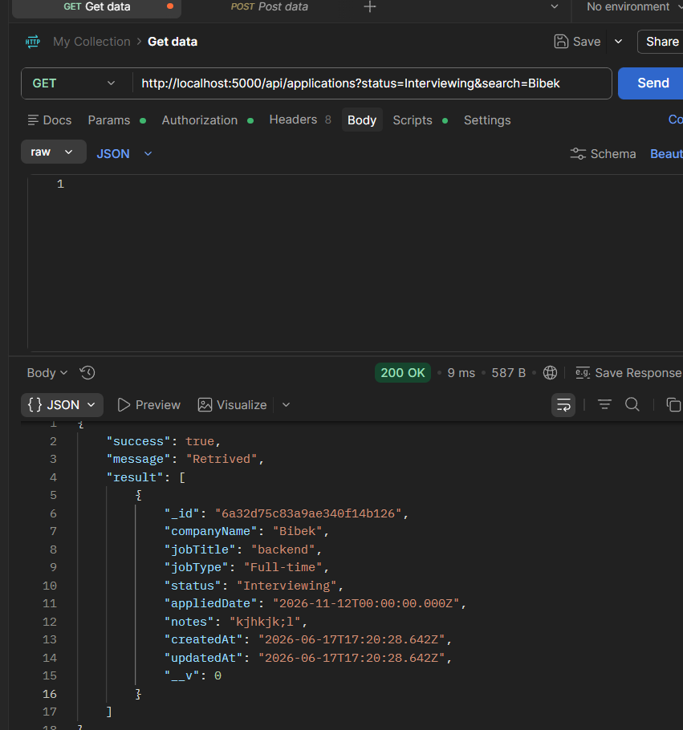

# Job Application Tracker

A full-stack web application for tracking job and internship applications through different hiring stages.

This project was developed as part of the InternSathi Full Stack Internship assignment.

## Project Status

The core application is complete and functional.

Users can:

* Create a new job application
* View all saved applications
* View complete application details
* Edit an existing application
* Delete an application with confirmation
* Filter applications by status
* Search by company name or job title
* See loading, empty, success, and error messages

## Tech Stack

### Frontend

* React
* Vite
* Axios
* CSS

### Backend

* Node.js
* Express.js
* MongoDB
* Mongoose

### Development Tools

* Postman
* Git
* GitHub

## Features

* Create job applications
* Display all applications
* View application details
* Edit applications
* Delete applications with confirmation
* Filter by application status
* Search by company name or job title
* Frontend form validation
* Backend schema validation
* Loading state
* Empty-state message
* Success and error feedback
* Responsive user interface
* API error and `404` handling

## Application Fields

Each application contains:

* Company name
* Job title
* Job type
* Application status
* Applied date
* Notes
* Created timestamp
* Updated timestamp

## API Endpoints

```http
GET    /api/applications
GET    /api/applications/:id
POST   /api/applications
PATCH  /api/applications/:id
DELETE /api/applications/:id
```

### Filter by status

```http
GET /api/applications?status=Applied
```

### Search by company name or job title

```http
GET /api/applications?search=intern
```

### Combine status and search

```http
GET /api/applications?status=Applied&search=intern
```

## Project Structure

```text
JobApplicationTracker/
├── client/         # React and Vite frontend
├── server/         # Node.js and Express backend
├── screenshots/    # API screenshots and demo video
├── package.json
├── .gitignore
├── LICENSE
└── README.md
```

## Prerequisites

Install the following before running the project:

* Node.js
* npm
* MongoDB

## Installation

```bash
git clone https://github.com/Bibek773/JobApplicationTracker.git
cd JobApplicationTracker
npm run install:all
```

## Run the Project

Start the frontend and backend together:

```bash
npm run dev
```

Frontend:

```text
http://localhost:5173
```

Backend:

```text
http://localhost:5000/api/applications
```

## Demo Video

[Watch the Job Application Tracker demo](screenshots/Jobtracker.mp4)

## API Screenshots

### Create Application


### Get All Applications


### Get Application by ID


### Update Application


### Delete Application


### MongoDB Record


### Application Search



## Author

**Bibek Ghimire**

* GitHub: [Bibek773](https://github.com/Bibek773)
* Portfolio: [ghimire-bibek.com.np](https://ghimire-bibek.com.np)

## License

This project is licensed under the [MIT License](./LICENSE).